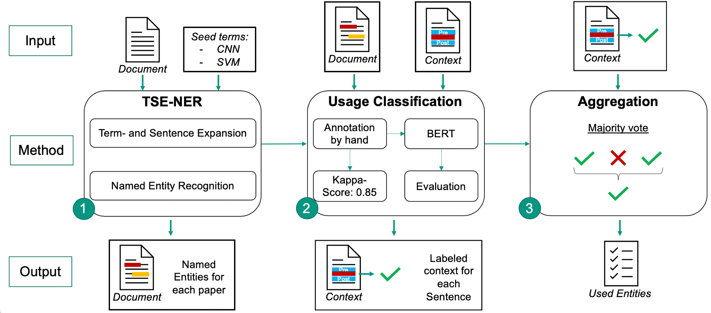

# Scholarly entity usage detection

## Abstract
We introduce a new method to extract named entities from scientific publications. Unlike other Named Entity Recognition tasks we extract those named entities which have actually been used in the papers, not just mentioned or proposed. We train our classification model on method and data set names and show that for both entity types equally good performance can be achieved. We show that our model can be applied to any entity type with minimal human interaction. We further create an extension to the Microsoft Academic Graph of the used entities which we use to analyze the information about used methods and data sets.

## Summary of our approach
Our [classification-pipeline](classification-pipeline) consists of a named entity recognition using a [TSE-NER](https://github.com/mvallet91/SmartPub-TSENER) approach, a [usage-classificator](usage-classificator) part
using [SciBERT](https://github.com/allenai/scibert) and finally an aggregation of sentence-level usage classification results to the document level.


## Structure of this project
This project is divided into several submodules. A detailed description can be found in the respective module subdirectories.

- [SmartPub-TSE-NER](SmartPub-TSENER): For named entity recognition, we train a CRF using TSE-NER, which is a fork of [mvallet91/SmartPub-TSENER](https://github.com/mvallet91/SmartPub-TSENER) but uses [SciBERT](https://github.com/allenai/scibert) instead of word2vec embeddings.
- [annotation-set-extraction](annotation-set-extraction) is used for creating the annotation data set that is used for training of our usage classificator.
- [annotators-agreement](annotators-agreement) is used for calculating the annotator agreement of the created data set.
- [usage-classificator](usage-classificator): Trains four different models for classifying whether an entity in a sentence has been used or proposed.
- [classification-pipeline](classification-pipeline): Applies both the TSE-NER model for named entitiy recognition as well as a trained usage classification model to a corpus of documents.
- [studies](studies) contains several jupyter notebooks for analysis of the results from the classification pipeline.
- [mag-extension](mag-extension) contains our extensions to the Microsoft Academic Graph.


## Contact
The system has been designed and implemented by Michael Färber, Alexander Albers, and Felix Schüber. Feel free to reach out to us:

[Michael Färber](https://sites.google.com/view/michaelfaerber), michael.faerber@kit&#46;edu

## How to Cite
Please cite our [work](https://aifb.kit.edu/images/2/2e/Identifying_Methods_Datasets_SDU2021.pdf) as follows:
```
@inproceedings{Faerber2021SDU,
  author    = {Michael F{\"{a}}rber and
               Alexander Albers and 
               Felix Schüber},
  title     = "{Identifying Used Methods and Datasets in Scientific Publications}",
  booktitle = "{Proceedings of the AAAI-21 Workshop on Scientific Document Understanding (SDU'21)@AAAI'21}",
  location  = "{Virtual Event}",
  year      = {2021}
}
```
