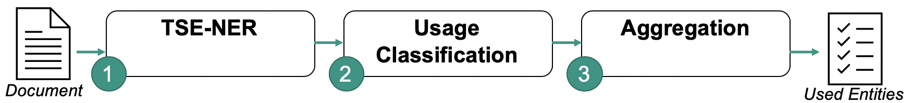
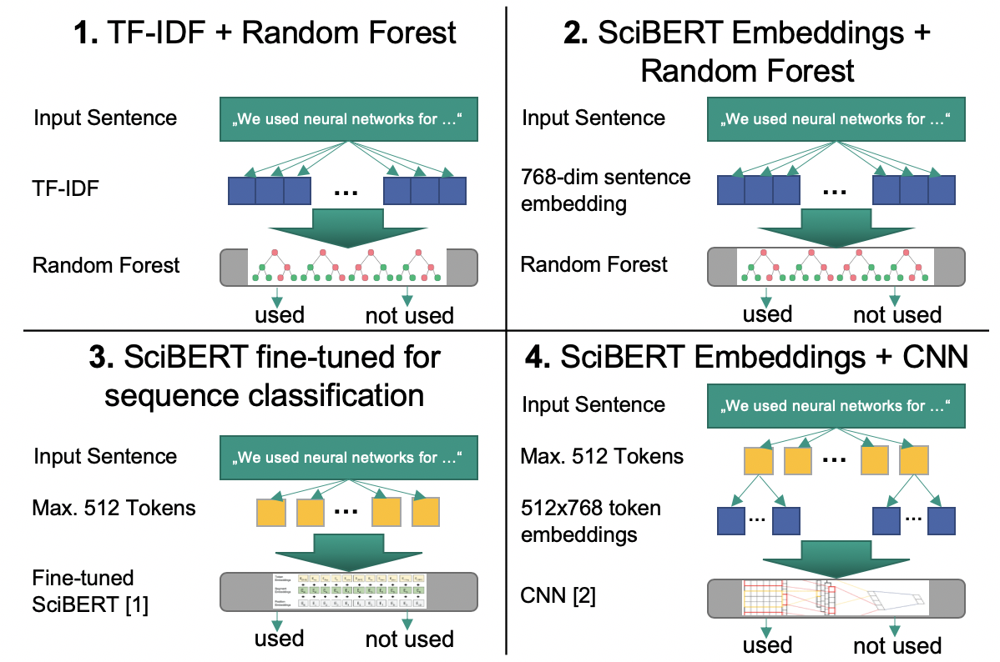

# Classification Pipeline for Information Extraction

This module can be applied to a corpus of documents in order to identify methods, datasets and more that have been
*used* by the authors. The Pipeline consists of three steps, which are explained in more detail below.

## Motivation
In recent years the application of Natural Language Processing (NLP) in the field of Information Extraction (IE) has
steadily grown. This is due to the fact that our current needs of IE are beyond the capabilities of simple search
engines. For example in the domain of scientific computer science papers, we would not only want to find relevant papers
based on authors, titles, conferences or number of citations. Instead, we want to develop an approach which can
recommend suitable data sets and computer science methods (i.e., algorithms) for a given problem description at hand.
To this end, it is necessary to determine which data sets and computer science methods have been used in which contexts.
We thus developed an approach which can recognize and extract data set and method mentions in papers automatically, and
decide if these entities are actually used or proposed.

---
## The Classification Pipeline in detail
Our classification pipeline consists of a named entity recognition using a TSENER approach, a usage classification part
using BERT and finally an aggregation of sentence-level usage classification results to the document level.

## Usage classification in detail
For our initial assessment, we analyzed four different usage classification models. Currently, only method 3 and 4 are
implemented, but others may be added in the future. For more information, see the 'usage classification' module.

[1] Beltagy, I., Lo, K., & Cohan, A. (2019). SciBERT: A pretrained language model for scientific text.  
[2] Kim, Y. (2014). Convolutional neural networks for sentence classification.

---

## Usage
See [requirements.txt](requirements.txt) for Python package requirements.  
Execute the classification pipeline using the following command:

`python __main__.py --entity_type <method|dataset> --document_id_input_file <input_file> --mag_directory <input_directory> --output_file <output_file>`

The `input_file` is a text file where each line is a document id from the Microsoft Academic Knowledge Graph.
The classification pipeline will search the specified `mag_directory` for the document id, where each file inside the
directory is named `<document_id>.tei.xml` (without the brackets) and contains the GROBID fulltext parsing output.
All results will be written into a CSV file specified by the `output_file` parameter.

Our fine-tuned SciBERT model can be found in a separate repository at [https://git.scc.kit.edu/2020-seminar-ie-from-cs-papers/classification-pipeline](https://git.scc.kit.edu/2020-seminar-ie-from-cs-papers/classification-pipeline/-/tree/master/models).

## Multiprocessing
This version runs in two processes. The first process is used for the usage classification task and the communication
with the GPU. The second process performs the NER for the next document in advance. This speeds up the classification
task significantly, at the cost of slightly worse code readability.
