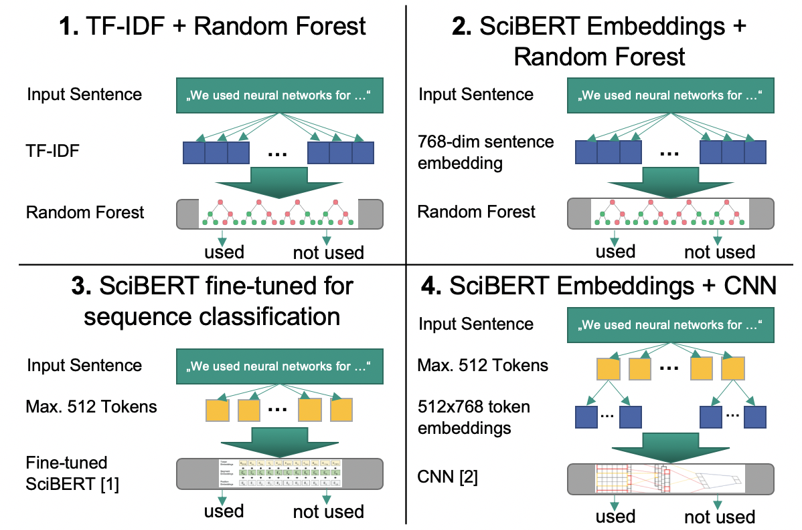

# Usage classification for Information Extraction

This module is part two of our classification pipeline. For more information about the general approach, visit the
classification pipeline module.

---
## Usage classification in detail
For our initial assessment, we analyzed the following four different usage classification models.
1. The baseline model vectorizes all sentences using TF-IDF and then performs the classification task using Random Forests.
2. The second approach converts an input sentence into a 768 dimensional sentence embedding using a pre-trained SciBERT
model. This embedding is again used in conjunction with Random Forests to predict the usage label.
3. The third model directly fine-tunes the SciBERT model for the usage classification task. The usage prediction directly
uses the trained model.
4. The last usage classification model uses a pre-trained SciBERT model in conjunction with a Convolutional Neural
Network. First, a 768 dimensional token embedding is generated for up to 512 tokens in a sentence. Next, this input is
fed into a CNN which then performs the usage classification.    

[1] Beltagy, I., Lo, K., & Cohan, A. (2019). SciBERT: A pretrained language model for scientific text.  
[2] Kim, Y. (2014). Convolutional neural networks for sentence classification.

## Results
### Method
#### Without context
method | recall | precision | acc | f1 | acc_and_f1
------ | --------- | ------ | --- | -- | ----------
Baseline: Random Forest (Max Depth=3) | 0.83 | 0.56 | 0.60 | 0.67 | 0.64
SciBERT + Random Forest | 0.71 | 0.77 | 0.73 | 0.74 | 0.73
SciBERT (fine-tuned) Sequence-Classification | 0.92 | 0.73 | 0.80 | 0.81 | 0.80
SciBERT + KimCNN | 0.79 | 0.76 | 0.78 | 0.77 | 0.77
#### With context
method | recall | precision | acc | f1 | acc_and_f1
------ | --------- | ------ | --- | -- | ----------
Baseline: Random Forest (Max Depth=5) | 0.76 | 0.69 | 0.71 | 0.72 | 0.72
SciBERT + Random Forest | 0.74 | 0.76 | 0.75 | 0.75 | 0.75
SciBERT Sequence-Classification | 0.84 | 0.76 | 0.79 | 0.80 | 0.79
SciBERT + KimCNN | 0.91 | 0.75 | 0.81 | 0.83 | 0.82

### Dataset
#### Without context
dataset | recall | precision | acc | f1 | acc_and_f1
------ | --------- | ------ | --- | -- | ----------
Baseline: Random Forest (Max Depth=3) | 0.83 | 0.56 | 0.60 | 0.67 | 0.64
SciBERT + Random Forest | 0.81 | 0.71 | 0.77 | 0.76 | 0.77
SciBERT (fine-tuned) Sequence-Classification | 0.89 | 0.76 | 0.83 | 0.82 | 0.83
SciBERT + KimCNN | 0.95 | 0.52 | 0.59 | 0.67 | 0.63
#### With context
dataset | recall | precision | acc | f1 | acc_and_f1
------ | --------- | ------ | --- | -- | ----------
Baseline: Random Forest (Max Depth=5) | 0.76 | 0.69 | 0.71 | 0.72 | 0.72
SciBERT + Random Forest | 0.84 | 0.73 | 0.79 | 0.78 | 0.79
SciBERT Sequence-Classification | 0.96 | 0.70 | 0.80 | 0.81 | 0.80
SciBERT + KimCNN | 0.92 | 0.54 | 0.59 | 0.67 | 0.63
---
## Usage
See [requirements.txt](requirements.txt) for Python package requirements.

To train or validate the models, use the usage-classificator.sh script:

`./usage-classificator.sh <mode:train|predict> <entity_type:method|dataset> <model_type:bert|cnn> <with_context:True|False> [validation_entity_type:method|dataset]`

For example:
`./usage-classificator.sh train method bert False`
